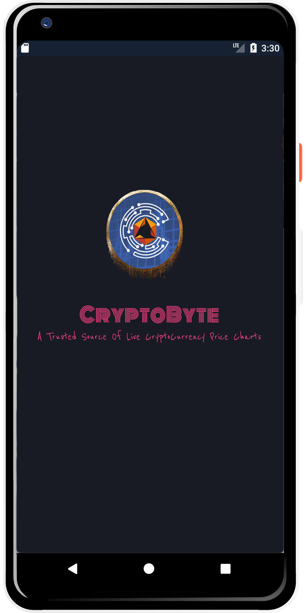
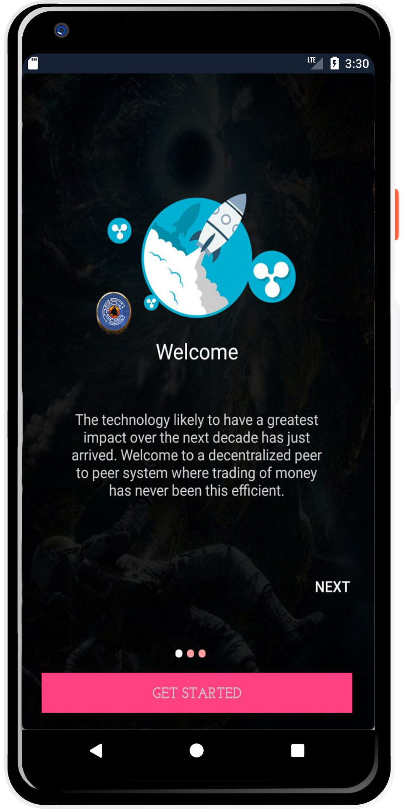
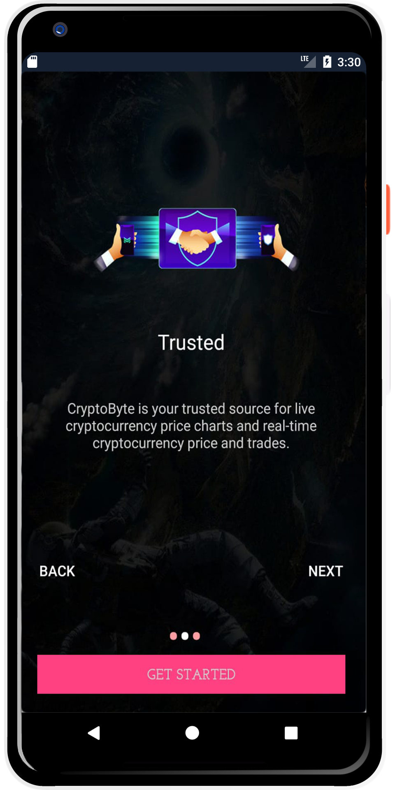
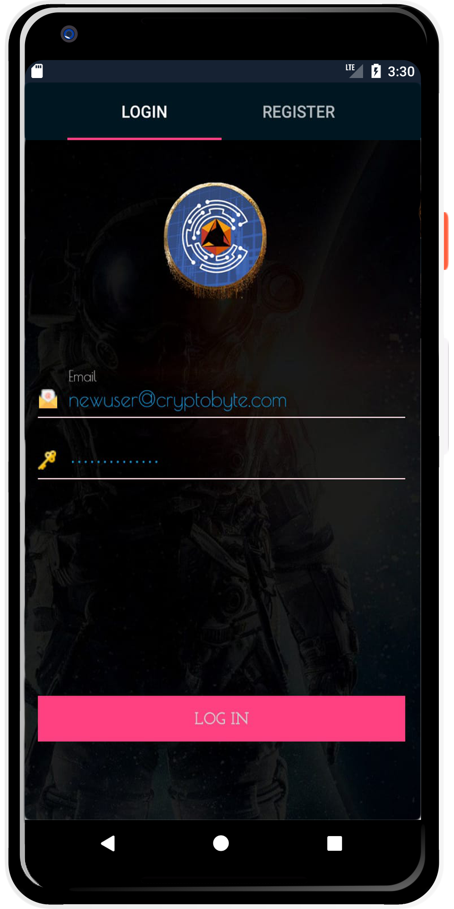
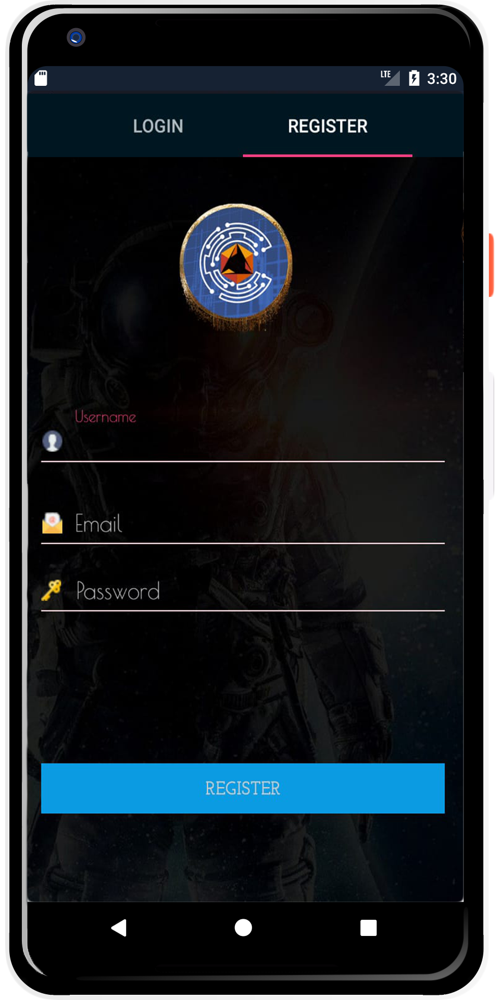
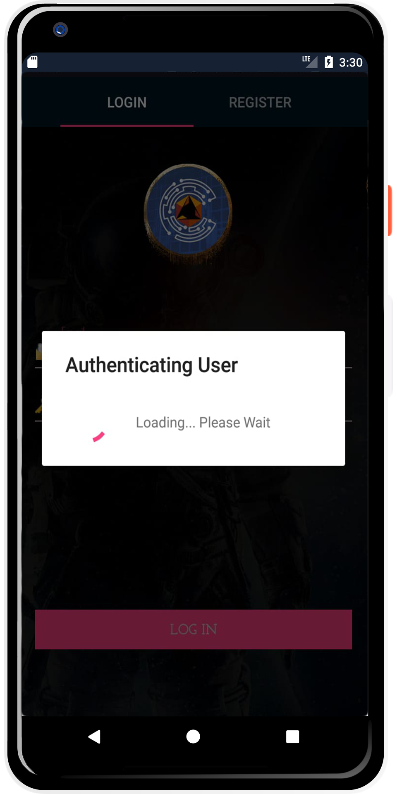
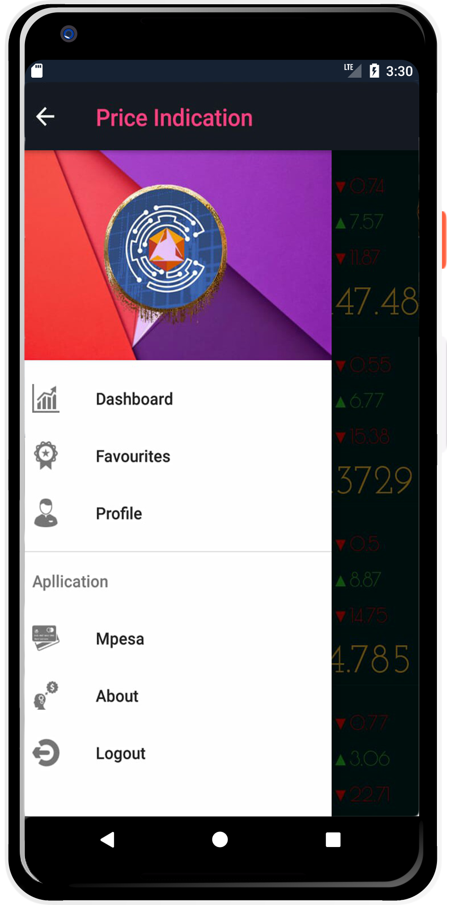
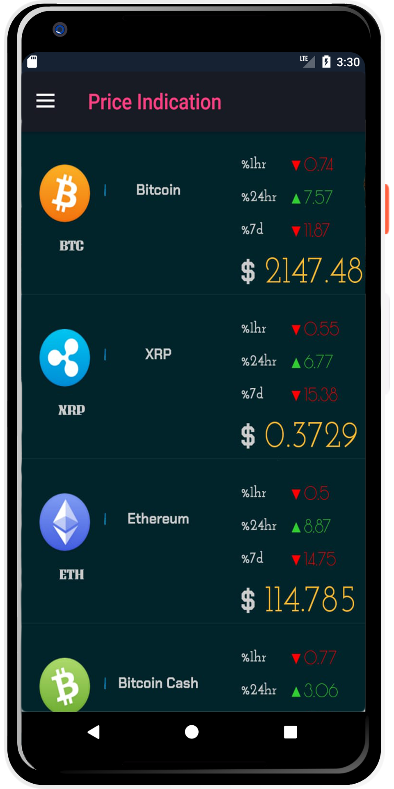
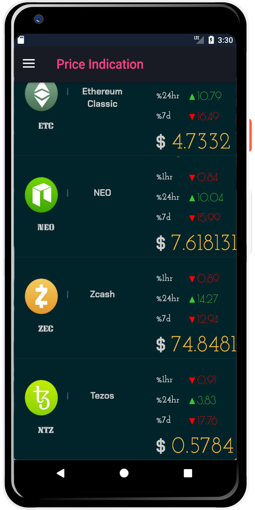

<p align="center">

<p>

# CRYPTOBYTE! :moneybag: :arrow_right: :iphone: 


## DESCRIPTION

This is a Digital Currency Application displaying market price listing based on trade volume and market capitalization.


## FEATURES

This Application allows users to view Cryptocurrency prices and monitor their rise and drop.

- User can **Register** and ***create an account***.

- User can **Login** with the credentials used to ***sign up***.

- User can **View Lists of Cryptocurrencies** ***with their prices.***

- For the ***prices user can*** keep track of **Hourly** (1hr), **Daily** (24hr) & **Weekly** (7dy), **Percentage Drop or rise**.

<p align="center">

<p>


## FUTURE IMPLEMENTATIONS.

- (Mainly Needed) **Update API** Used to the **lastest Version released [Version 2](https://coinmarketcap.com/api/)**.

- **Attach Dashboard** in the navigation drawer to the ***Activity Displaying Lists of cryptocurrencies*** **(Coin Activity)**.

- Add **Activity View for Favourites** and attach it to the ***Navigation Drawer in favourites section***.From favourites users can **highlight coins they are interested in** or prefer and just get monitor them directly. Drag and drop will be prefered however other methods could be used.

- Add **Activity View for User Profile** and ***attach it to the Navigation Drawer***. Here users can add their profile and maybe even list crypto's they are interested in.

- **Add Daraja API** which is a **USSD mobile to mobile payment** however it only uses ***Safaricom service provider Sim***. this way users can buy cryptocurrencies which will be loaded onto their accounts. It is fast and very effective especially in Kenya. Also very challenging to integrate.

- **Add Paypal API** for payment this way users will not only be **limited to paying using mpesa** as not everyone can access Mpesa outside kenya. **Other methods better than paypal may also be explored**.

- **Add About page** that will always be updated ***to inform users what the application is about***, and also the offer useful information about the product.The about page will be linked to about section in navigation drawer.


## INSPIRATION

Recently I've had a particularly sparked interest in Digital Currency Specifically cryptocurrency.

If you asked me I believe Blockchain Technology might be the Second best invention after the Internet.

However I might be wrong too. When it comes to technology there is always a complexity to determine it's future as things evolve really quick. So pardon me if you read this 10 years from when I wrote and discover I was terriblly wrong. :dizzy_face: My sincerest apologies. :smiley:


**However Lets Talk Code!** :computer:

**This project** came to mind after **Inspiration** by **[Brian Armstrong's](https://github.com/barmstrong)** project **[Bitcoin-Android](https://github.com/barmstrong/bitcoin-android)**. 

I wanted to **challenge myself** with code as I try wrap my head around the **Cryptocurrency world**.

I **believe** I have achieved that but I still have a long way to go in **understanding this masive world** as I strive valiently.


## PRE-REQUISITES.

A couple of things to get you started:

1. Ensure you have [Java](https://java.com/en/download/) installed

A simple way to install Java is using [sdkman](https://sdkman.io/).

Simply follow the instructions to have _sdkman_ installed and install java:

```bash
sdk install java
```

2. [Gradle](https://gradle.org/)

Gradle is used as the build tool and can be installed with sdkman:

```bash
sdk install gradle
```

3. [Android SDK](https://developer.android.com/studio/)

Android SDK used to provide all the necessary developer tools to build, test, and debug apps for Android in Windows, Mac or Linux.

4. [Android Build Tools](https://developer.android.com/studio/releases/build-tools)

Android SDK build tools used to debug, build, run and test an Android application.


### IMPORTANT TERMS TO TAKE NOTE. :smiley:

**Some Basic knowlegde useful to understanding the project or just for fun**

**What is the "Value of Bitcoin" ?**

The ***Value of Bitcoin*** is actually the trust and utility of the Bitcoin network itself. In reality its just worth what someone is willing to pay for it.

**What is "Market Capitalization" and how is it calculated?**

***Market Capitalization*** is one way to rank the relative size of a cryptocurrency. It's calculated by multiplying the Price by the Circulating Supply.

Market Cap = Price X Circulating Supply.

**What is "Circulating Supply"**

***Circulating Supply*** is the best approximation of the number of coins that are circulating in the market and in the general public's hands.

**What is "Total Supply"**

***Total Supply*** is the total amount of coins in existence right now (minus any coins that have been verifiably burned).

- **What is "Max Supply"**

***Max Supply*** is the best approximation of the maximum amount of coins that will ever exist in the lifetime of the cryptocurrency.

- **Why is the Circulating Supply used in determining the market capitalization instead of Total Supply?**

Coins that are locked, reserved, or not able to be sold on the public market are coins that can't affect the price and thus should not be allowed to affect the market capitalization as well. The method of using the Circulating Supply is analogous to the method of using public float for determining the market capitalization of companies in traditional investing.


#### Splash Page.

<p align="center">



<p>

#### Login & Register.

<p align="center">



<p>


#### Home Page.

<p align="center">



<p>


## TECHNOLOGIES USED:

1. **[Adobe Photoshop](https://www.adobe.com/products/photoshop.html)**

***Photoshop*** is a **photo editing software**.

Photoshop was really useful in ***creating*** and ***enhancing photos***.

**The Logo** **was designed by photoshop** just as many ***images had to be redesigned to fit in to the application user expirience***. 

2. **[Java](https://java.com/en/download/)**

**source language.**

3. **[Gradle](https://gradle.org/)**

**For dependency management and running tasks.**

4. **[Android SDK](https://developer.android.com/studio/)**

**For providing all the necessary developer tools to build, test, and debug Android applications on Windows, Mac or Linux.**

5. **[Android Build Tools](https://developer.android.com/studio/releases/build-tools)**

**For debugging, building, running and testing an Android applications.**

6. **[Coin Market Cap API](https://coinmarketcap.com/api/documentation/v1/)**

**Coin Market Cap** is a platform which provides fast, reliable and unified data APIs to cryptocurrency markets.

**Coin Market API** was used to get price listings on cryptocurrencies based on trade volume and market capitalization.

For more info about the API check out the API Section below.

7. **[FireBase](https://firebase.google.com/)**

**Was used to authenticate users and register users and ensure user is logged in to run the application**

FireBase is a NoSQL **cloud database**. Data is synced across all clients in realtime, and remains available when your app goes offline. The Firebase Realtime Database is a cloud-hosted database. Data is stored as JSON and synchronized in realtime to every connected client.


## LIBRARIES TO NOTE.

1. **[GSON](https://github.com/google/gson)**

- **GSON was used in the API to convert Java Objects into JSON and back**

- Gson is a Java library that can be used to convert Java Objects into their JSON representation. It can also be used to convert a **JSON string** to an **equivalent** **Java object**. Gson can work with arbitrary Java objects including pre-existing objects that you do not have source code of.

2. **[okHttp 3](https://github.com/square/okhttp)**

- OkHttp is a third party library used for sending and receiving HTTP-based network requests.

3. **[Picasso](https://github.com/square/okhttp)**

- Picasso was used to display cryptocurrency logos.

- **Picasso** is an image library for **Android**.It caters to image loading and processing. It simplifies the process of displaying images from external locations


4. **[ButterKnife](http://jakewharton.github.io/butterknife/)**

- **Android Butterknife** is a **view binding tool** that uses annotations to **generate boilerplate code** for us.

## COIN MARKET CAP API

***Coin Market API*** Provides crypto market data endpoints **market price listing based on trade volume and market capitalization**.

For CryptoByte **Gson components were used to parse JSON into Java objects**.

***Gson*** is an open source **Java library to serialize and deserialize Java objects to JSON**.

The benefit you get with GSON is that ***object mapping can save the time spent writing code***.

Click here to Check out :point_right: **[Coin Market API](https://coinmarketcap.com/api/)**

### API DESCRIPTION

**Ticker**

This endpoint displays ticker data for a specific ***cryptocurrency**. Use the **"id" field** from the ***Listings endpoint*** in the URL.

**Global Data**

This endpoint displays the **global data** found at the top of ***coinmarketcap.com***.

**Limits**

API ***Endpoints*** are update every **5 minutes**.

**Mics**

All **'last_updated'** fields are [unix timestamps](https://en.wikipedia.org/wiki/Unix_time)


## **SETUP/INSTALLATION!**


1. You will need **Internet connection**.

2. You need to get into the **Coin-Base-BlockChain-Android Repository**.

Link:-> ```https://github.com/zecollokaris/CryptoByte-Blockchain-Android```

3. From there you can access **CryptoByte**.

4. **Clone** the project.

5. **get into project folder** (cd into project).

6. If you have all the **Pre-requisites**

7. Open your **Android Studio Editor and run the Application**.


## How to contribute

All contributions are welcome, from code to documentation to graphics to design suggestions to bug reports. Please use GitHub to its fullest. Whatever you have to offer, we can use it!


## Support & Contact

- Mobile number: (+254) 798731203

- Email Address: collo.kariss@gmail.com

- github-username: [zecollokaris](https://github.com/zecollokaris)

## LICENSE

This project is licensed under the **MIT License** - see the [LICENSE](LICENSE) file for details.
